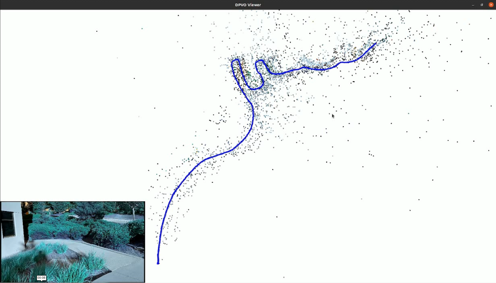

<!--
  (C) 2025-2026 Wistron NeWeb Corporation (WNC) - All Rights Reserved

  This software and its associated documentation are the confidential and
  proprietary information of Wistron NeWeb Corporation (WNC) ("Company") and
  may not be copied, modified, distributed, or otherwise disclosed to third
  parties without the express written consent of the Company.

  Unauthorized reproduction, distribution, or disclosure of this software and
  its associated documentation or the information contained herein is a
  violation of applicable laws and may result in severe legal penalties.
-->
# 🚀 WNC APP Execution Guide

Quick guide for setting up, building, and running the DPVO application.

## 📹 Demo Video




## 🐳 Docker Environment Setup

This section explains how to create the custom Docker image with Pangolin and ONNX Runtime support.

### 🔧 Creating Custom Docker Image

1. **📦 Start with base Ashacam Docker image:**
   ```bash
   DOCKER_IMAGE="192.168.50.130:9500/amba_cv28:v0.1-AshaCam_v0.0.1.a"
   ```

2. **▶️ Run setup script to enter Docker:**
     ```bash
   ./setup.sh
   ```
   ⚠️ (Make sure `setup.sh` uses the base image above)

3. **📊 Install Pangolin in Docker environment:**
   ```bash
   # Inside Docker container
   git clone https://github.com/stevenlovegrove/Pangolin.git
   cd Pangolin
   mkdir build && cd build
   cmake ..
   make -j$(nproc)
   sudo make install
   ```

4. **🤖 Install ONNX Runtime in Docker environment:**
   ```bash
   # Inside Docker container
   # Download ONNX Runtime (adjust version as needed)
   wget https://github.com/microsoft/onnxruntime/releases/download/v1.16.3/onnxruntime-linux-x64-1.16.3.tgz
   tar -xzf onnxruntime-linux-x64-1.16.3.tgz
   export ONNXRUNTIME_ROOT=/tmp/onnxruntime-linux-x64-1.16.3
   ```

5. **💾 Save the customized Docker image:**
   ```bash
   # From host machine (exit Docker first)
   docker commit <container_id> 192.168.50.130:9500/amba_cv28:v0.1-AshaCam_v0.0.1.a-pangolin-onnx
   docker push 192.168.50.130:9500/amba_cv28:v0.1-AshaCam_v0.0.1.a-pangolin-onnx
   ```

6. **✏️ Update setup.sh to use the new image:**
   ```bash
   # Edit setup.sh and change:
   DOCKER_IMAGE="192.168.50.130:9500/amba_cv28:v0.1-AshaCam_v0.0.1.a-pangolin-onnx"
   ```

💡 **Note:** The pre-built image `v0.1-AshaCam_v0.0.1.a-pangolin-onnx` is already available and configured in `setup.sh`.

## 🎯 Quick Start Guide

Follow these three steps to run the application:

### Step 1: 🐳 Setup Docker Environment

Run the setup script to enter the Docker environment:

```bash
./setup.sh
```

**⚠️ Important:** Before running `setup.sh`, edit the script to set your project path:
```bash
SRC_DIR="/path/to/your/DPVO_AMBA"  # Change this to your actual project path
```

### Step 2: 🔨 Build the Application

**📝 Before building**, configure `build/config/app_config.txt`:

1. Set camera intrinsics:
   ```ini
   Intrinsic_fx = 1660.0
   Intrinsic_fy = 1660.0
   Intrinsic_cx = 960.0
   Intrinsic_cy = 540.0
   ```

2. Configure model paths (ONNX or CV28 models)

3. Build the application:
     ```bash
   ./build.sh
     ```

**✅ Output:** If successful, `wnc-app` binary will be generated in `build/` folder.

**🔄 Rebuild when:** You modify C++ code in `app/src/` or `app/inc/`.

### Step 3: ▶️ Run the Application

1. Place video files in `build/videos/` directory
2. Run:
  ```bash
   ./run.sh
   ```

## ⚙️ Configuration File

**Location:** `build/config/app_config.txt`

**Key Settings:**

- **Camera Intrinsics** (Required):
  ```ini
  Intrinsic_fx = 1660.0
  Intrinsic_fy = 1660.0
  Intrinsic_cx = 960.0
  Intrinsic_cy = 540.0
  ```

- **Model Paths:**
  ```ini
  UseOnnxRuntime = 1
  FnetModelPath = models/out/onnx_models/fnet.onnx
  InetModelPath = models/out/onnx_models/inet.onnx
  UpdateModelPath = models/out/onnx_models/update.onnx
  ```

- **Input Mode:**
  ```ini
  InputMode = 1  # 0=live, 1=file, 2=historical
  ```

## 🔧 Common Issues

**❌ Build fails**
- Ensure you're inside Docker container (run `./setup.sh` first)
- Check you're in project root directory (`/src` inside Docker)

**❌ "wnc-app: command not found"**
- Verify `build.sh` completed successfully
- Check `build/wnc-app` exists: `ls -l build/wnc-app`

**❌ Video files not found**
- Ensure videos are in `build/videos/` directory
- Check file permissions

**❌ Docker container won't start**
- Check Docker is running: `sudo systemctl status docker`
- Verify Docker image exists: `docker images | grep amba_cv28`
- Check `SRC_DIR` path in `setup.sh` is correct

## 📂 Project Structure

```
DPVO_AMBA/
├── app/              # Source code (src/, inc/)
├── build/            # Build output and runtime files
│   ├── wnc-app      # Executable (generated)
│   ├── config/      # Configuration files
│   ├── videos/      # Input videos (PUT VIDEOS HERE!)
│   └── models/      # Model files
├── setup.sh         # Docker setup
├── build.sh         # Build script
└── run.sh           # Run script
```

## 🆘 Getting Help

- Check logs: `build/debug/logs/`
- Enable debug in `app_config.txt`:
  ```ini
  DebugAPP = 1
  DebugSaveLogs = 1
  ```
- Review `CHANGELOG.md` for updates
